# 工程概览（MonoApp）

本文档基于当前仓库代码现状梳理 MonoApp 的目录结构、应用分层、共享包职责、工程治理和依赖边界，适合作为进入仓库后的第一份全局说明。

## 1. 一句话理解

这是一个基于 `pnpm workspace` 的前端 Monorepo：

- `apps/` 放可运行应用
- `packages/` 放共享基础能力、运行时装配层和 SDK
- 根目录统一负责工作区配置、质量门禁、CI/CD 和发布治理

当前仓库一共包含：

- 3 个应用：`admin-web`、`portal-web`、`ai-console`
- 16 个共享包：`@frontend/*`
- 2 个工程配置包：`@frontend/eslint-config`、`@frontend/vitest-config`

其中：

- `admin-web` 已是完整可运行的管理端应用
- `portal-web` 已是完整可运行的门户应用
- `ai-console` 是 AI 工作台预备应用，当前不纳入生产前端发布包

## 2. 顶层目录

```text
MonoApp/
├─ apps/                       # 业务应用
├─ packages/                   # 共享能力与 SDK
├─ docs/                       # 工程说明与执行手册
├─ scripts/                    # 工作区校验脚本
├─ tests/                      # E2E 测试入口
├─ .changeset/                 # 版本记录与发布治理
├─ .husky/                     # Git hooks
├─ .github/workflows/          # GitHub Actions 部署工作流
├─ package.json                # 根脚本与统一 devDependencies
├─ pnpm-workspace.yaml         # Workspace 范围
├─ tsconfig.base.json          # 全局 TS 配置与 @frontend/* 路径别名
└─ README.md                   # 仓库入口说明
```

## 3. Workspace 结构

`pnpm-workspace.yaml` 当前包含 3 类工作区：

```yaml
packages:
  - apps/*
  - packages/*
  - packages/*/*
```

前两项用于纳入应用和共享包，`packages/*/*` 用于纳入分层 SDK 的子目录入口，例如 `core`、`plugin`、`adapter`、`api`、`components` 与 `composables`。

## 4. 应用层现状

### 4.1 `apps/admin-web`

管理端主应用，技术栈为 `Vue 3 + Vite + TypeScript + Pinia + Vue Router + Element Plus`。

当前真实职责：

- 管理端登录、注册与会话恢复
- 基于权限的后台路由访问控制
- 后台首页、内容管理与资源类页面承载
- 共享登录、权限、监控、埋点、AI 面板的装配

当前主要目录：

- `src/api/`：基于 `@frontend/app-runtime` 的业务 HTTP 装配
- `src/auth/`：登录态与权限同步运行时
- `src/permission/`：后台路由权限模型与 landing path 规则
- `src/router/`：登录守卫、token 刷新、权限注水
- `src/views/`：后台页面
- `src/components/`：后台业务组件
- `src/styles/`：样式入口与暗黑覆盖

当前页面路由已落地为：

- `/login`
- `/register`
- `/home/overview`
- `/home/manage`
- `/home/admin/overview`
- `/home/admin/manage`
- `/home/books`
- `/home/topics`
- `/home/images`
- `/home/articles`

开发默认端口：`5173`。

### 4.2 `apps/portal-web`

门户应用，技术栈同样是 `Vue 3 + Vite + TypeScript + Pinia + Vue Router + Element Plus`。

当前运行时结构：

- 门户首页
- 登录/注册弹窗路由
- 受保护的工作台页
- 文章、专题、书单、图库模块页
- 文章、专题、书单、图库详情页
- 图库模块独立查询与自动加载逻辑
- 门户组件插件、图标注册、主题切换

当前主要目录：

- `src/api/`：门户首页、模块页、详情页与工作台等 API
- `src/auth/`：登录态和权限同步运行时
- `src/components/`：顶部导航、图片组件、请求边界、图标组件等
- `src/constants/`：门户业务路由和模块常量
- `src/permission/`：门户公开权限、会员权限和操作权限定义
- `src/router/`：公开路由、受保护路由和预加载逻辑
- `src/styles/`：单入口 `index.css`、亮色 token 分层目录 `tokens/`、暗色镜像目录 `tokens-dark/`
- `src/views/home/`：门户首页
- `src/views/modules/gallery/`：图库模块
- `src/views/public/`：公开详情页
- `src/views/workspace/`：工作台与无权限页

其中受保护工作台路由为 `/workspace`，详情页路由已明确实现为：

- `/articles/:id`
- `/topics/:id`
- `/books/:id`
- `/galleries/:id`

开发默认端口：`5174`。

### 4.3 `apps/ai-console`

当前定位：

- `package.json` 中 `dev/build/lint/typecheck/test` 用于保持 workspace 命令闭环
- `src/` 与 `public/` 已创建，后续承载 AI 工作台运行时

当前生产发布包只包含 `portal-web` 与 `admin-web`。

## 5. 共享包分层

### 5.1 基础基础设施包

| 包名                    | 当前职责                   | 关键内容                                                  |
| ----------------------- | -------------------------- | --------------------------------------------------------- |
| `@frontend/config`      | 环境变量读取与校验         | `loadEnvConfig`、运行时 dev/test 代理判断                 |
| `@frontend/constants`   | 共享常量                   | 命名空间、主题存储 key、默认超时                          |
| `@frontend/types`       | 共享类型                   | `BaseEntity`、`ApiResponse`、分页类型                     |
| `@frontend/composables` | 通用组合式逻辑             | 当前提供 `useThemeToggle`                                 |
| `@frontend/theme`       | 主题 token、字体与主题调度 | `light.css`、`dark.css`、`element-plus.css`、字体懒加载   |
| `@frontend/ui`          | 基础 UI 插件               | `FrontendUi` 插件、`FrontendBaseCard`                     |
| `@frontend/store`       | 共享 Pinia 模块            | `app`、`user`、`theme` 模块                               |
| `@frontend/request`     | 通用 HTTP 客户端           | Axios client、`auth/error/permission/trace/unwrap` 拦截器 |
| `@frontend/app-runtime` | 跨应用装配层               | 会话同步、认证 API、HTTP 运行时、观测运行时               |

`app-runtime` 不是新的业务 SDK，而是把登录、权限、HTTP 和观测能力拼接成应用可以直接使用的一层装配 API。

### 5.2 领域 SDK 包

| 包名                       | 当前职责                               | 分层结构                                   |
| -------------------------- | -------------------------------------- | ------------------------------------------ |
| `@frontend/login-sdk`      | Token、OAuth、SSO、登录插件注入        | `core / plugin / adapter`                  |
| `@frontend/permission-sdk` | 权限引擎、路由守卫、指令               | `core / plugin / adapter`                  |
| `@frontend/tracking-sdk`   | 埋点事件、上下文、队列、存储、上报适配 | `core / plugin / adapter`                  |
| `@frontend/monitor-sdk`    | 错误、日志、性能监控与适配             | `core / plugin / adapter`                  |
| `@frontend/ai-sdk`         | AI API、适配器、现成组件、composables  | `api / components / composables / adapter` |

### 5.3 工程配置包

| 包名                      | 当前职责                                                       |
| ------------------------- | -------------------------------------------------------------- |
| `@frontend/eslint-config` | 统一 ESLint 配置导出；其 `build/lint/typecheck` 是 skip 型脚本 |
| `@frontend/vitest-config` | 统一 Vitest 配置导出；应用侧 `vitest.config.ts` 只保留薄壳接入 |

## 6. 应用启动装配链路

`admin-web` 和 `portal-web` 的 `src/main.ts` 基本遵循同一套启动顺序：

1. `loadEnvConfig(import.meta.env)` 读取环境变量
2. 创建 `Pinia`
3. 初始化 `userStore` 和 `themeStore`
4. 调用 `setupObservabilityRuntime` 装配监控和埋点
5. 创建 `loginSdk`
6. 创建 `permissionEngine`
7. 调用应用级 `setupAuthRuntime`
8. 调用应用级 `setupHttpClient`
9. 处理 OAuth 回调
10. 安装 `router / pinia / ElementPlus / FrontendUi / 各类 SDK plugin`
11. 挂载 `AiChatPanel`
12. `router.isReady()` 后同步观测上下文并挂载应用
13. 延迟加载主题字体

可以把这条主链路理解为：

```mermaid
flowchart LR
    A["loadEnvConfig"] --> B["setupObservabilityRuntime"]
    B --> C["createOauthLoginSdk"]
    C --> D["createPermissionEngine"]
    D --> E["setupAuthRuntime"]
    E --> F["setupHttpClient"]
    F --> G["handleOAuthCallbackFromLocation"]
    G --> H["install Vue plugins"]
    H --> I["router.isReady + syncContext"]
    I --> J["app.mount + scheduleThemeFontsLoad"]
```



## 7. 运行时配置与环境变量

`@frontend/config` 当前要求以下关键环境变量：

- `VITE_APP_TITLE`
- `VITE_API_BASE_URL`
- `VITE_SSO_BASE_URL`
- `VITE_MONITOR_DSN`
- `VITE_TRACKING_APP_ID`
- `VITE_AI_API_BASE_URL`

同时支持默认值：

- `VITE_API_PREFIX`：默认 `/api/v1`
- `VITE_OAUTH_PROVIDER`：默认 `google`

两个可运行应用都已经存在：

- `.env.development`
- `.env.test`
- `.env.production`

`loadEnvConfig` 在 `development/test` 下会把运行时 `apiBaseUrl` 置为空字符串，配合 Vite dev server 的 `/api` 代理使用；真正的代理目标由各应用 `vite.config.ts` 中的 `VITE_API_BASE_URL` 提供。

## 8. 构建与测试的真实含义

当前仓库里“build”并不都意味着产出制品：

- `apps/admin-web`：`vite build`，会产出 `apps/admin-web/dist`
- `apps/portal-web`：`vite build`，会产出 `apps/portal-web/dist`
- `apps/ai-console`：执行工作区闭环命令，不产出生产构建物
- 绝大多数 `packages/*`：`tsc -p tsconfig.json --noEmit`，是“校验式 build”
- `@frontend/eslint-config`：`build` 为 skip 输出

因此当前 Monorepo 的共享包更像“源码工作区依赖”，而不是“先构建 dist 再被应用消费”的发布型包。

## 9. 根目录工程治理

### 9.1 根脚本

根 `package.json` 当前提供：

- 启动：`dev:admin`、`dev:portal`、`dev:ai`
- 质量：`lint`、`typecheck`、`test`
- 构建：`build`
- 格式化：`format`
- 提交治理：`lint-staged`、`commitlint`
- 发布治理：`changeset`、`version-packages`、`release`

### 9.2 Git Hooks

`.husky/` 当前启用：

- `pre-commit` -> `pnpm lint-staged`
- `commit-msg` -> `pnpm commitlint --edit "$1"`

### 9.3 路径别名

`tsconfig.base.json` 已统一声明：

- `@frontend/ui`
- `@frontend/theme`
- `@frontend/types`
- `@frontend/constants`
- `@frontend/composables`
- `@frontend/request`
- `@frontend/store`
- `@frontend/config`
- `@frontend/app-runtime`
- `@frontend/login-sdk`
- `@frontend/permission-sdk`
- `@frontend/tracking-sdk`
- `@frontend/monitor-sdk`
- `@frontend/ai-sdk`
- `@frontend/eslint-config`
- `@frontend/vitest-config`

应用层不应跨 `apps/*` 互相依赖，而是通过这些共享入口访问公共能力。

### 9.4 脚本与测试目录

- `scripts/verify-workspace.mjs`：校验工作区关键文件是否存在
- `tests/e2e/README.md`：E2E 测试入口说明

## 10. GitHub Actions 部署现状

前端部署入口为：

```text
.github/workflows/deploy-frontend.yml
```

真实构建与部署行为：

- 推送 `web-v*` tag 触发生产部署，例如 `web-v1.0.0`。
- `main` 分支 push 不直接发布生产前端。
- 先执行 `pnpm lint`、`pnpm typecheck`、`pnpm test`。
- GitHub Variables 采用共享默认值加应用独立覆盖：`FRONTEND_*` 作为共享默认，`PORTAL_*` / `ADMIN_*` 覆盖单个应用；每个发布应用必须能解析出 `VITE_API_BASE_URL`。
- `portal-web` 以 `VITE_APP_BASE=/` 构建并发布到站点根路径。
- `admin-web` 以 `VITE_APP_BASE=/admin/` 构建并发布到 `/admin/` 子路径。
- 两个 dist 打包为 `frontend.tar.gz` 上传至 `/www/apps/frontend/shared`。
- 服务器解压到 `/www/apps/frontend/releases/<tag>`，再原子切换 `/www/apps/frontend/current`。

服务器发布结构：

```text
/www/apps/frontend
/www/apps/frontend/releases
/www/apps/frontend/shared
/www/apps/frontend/current
```

## 11. 依赖边界约定

- `apps/*` 只依赖 `packages/*`，不跨应用依赖
- 通用能力优先沉到 `packages/*`
- 共享包之间尽量通过清晰入口导出能力，避免循环依赖
- 权限、登录、埋点、监控这类跨应用能力优先在共享包中落地
- 应用层主要负责业务页面、业务 API、业务权限模型和启动装配

## 12. 推荐阅读顺序

建议按下面顺序建立对仓库的整体认知：

1. `README.md`
2. `docs/workflows/README.md`
3. `docs/overview.md`
4. `apps/admin-web/src/main.ts`
5. `apps/portal-web/src/main.ts`
6. `packages/app-runtime/src/index.ts`
7. `packages/request/src/index.ts`
8. `packages/login-sdk/index.ts`
9. `packages/permission-sdk/index.ts`
10. 按需进入具体应用页面和具体 SDK
